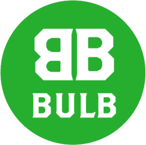

# BULB

**A hackathon project by [Adrienne](https://github.com/aes89) & [Nick](https://github.com/nick-ducker)**

****

## Welcome to Bulb!

A Hackathon project made for CoderAcademy by [@Adrienne_es](https://twitter.com/Adrienne_es) & [@DriftingDev](https://twitter.com/DriftingDev)

## The Challenge

Bulb was built as part of a 3 day hackathon done as part of the curriculum of CoderAcademy

The aim of the hackathon was to create a functional, hosted web application using only HTML and vanilla JS. Styling add-ons were also permitted.

## The App

Bulb is a webscraper/API synthesizer, designed to consolidate planting and harvesting information for household Australian gardeners.

It achieves this through essentially running a web-scraper on the ABC website to compile a list of plants suitable for planting depending on a selected region and month.

From here, Bulb then searches for the plant on the Growstuff API and tries to pull up specific information about that plant.

In it's current version, Bulb can generally find and accurate match 90% of the time, but will sometimes pull up the wrong plant if the search term starts with a general descriptor (such as "sweet") or the scraped plant name contains brackets or is uncommon.